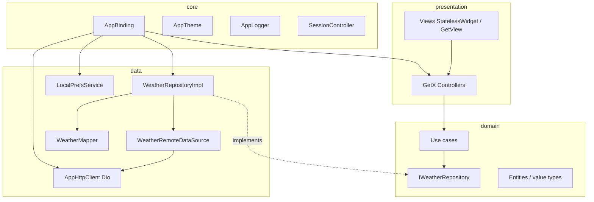

# Weather App

A Flutter application that shows **current weather** for the device location and supports **city search** with suggestions, history, and detailed conditions. The codebase follows **clean architecture**, uses **GetX** for state management, routing, and dependency injection, and **Dio** for all HTTP traffic to [OpenWeatherMap](https://openweathermap.org/).

---

## Table of contents

- [Features](#features)
- [Tech stack](#tech-stack)
- [Architecture](#architecture)
- [Project structure](#project-structure)
- [Getting started](#getting-started)
- [Configuration](#configuration)
- [Data flow](#data-flow)
- [Routing](#routing)
- [Development](#development)
- [Security & production notes](#security--production-notes)
- [Troubleshooting](#troubleshooting)

---

## Features

- **GPS weather** — Requests location permission, resolves coordinates with Geolocator, loads weather via OpenWeather **Current Weather API** (`/data/2.5/weather`).
- **City search** — Debounced queries against OpenWeather **Geocoding 1.0** (`/geo/1.0/direct`) for up to five suggestions per query; ranking and deduplication in the data/domain layers.
- **Disambiguated selection** — Weather after a city pick is loaded by **latitude/longitude**, not by name alone, reducing wrong-city results.
- **Search history** — Recent selections persisted with `SharedPreferences` (see `StorageKeys.citySearchHistory`).
- **In-memory suggestion cache** — TTL-based cache in the repository to limit duplicate network calls for the same normalized query.
- **Global loading overlay** — Driven by `AppApiLoadingController` and Dio interceptors; **geocoding** requests use a “quiet” flag so the full-screen overlay does not flash on every keystroke.
- **Structured HTTP logging** — `AppLogger` logs requests, responses, and errors with sensitive query/header redaction.

---

## Tech stack

| Area | Choice |
|------|--------|
| Language | Dart **^3.5.3** |
| UI | Flutter (Material 3 via `AppTheme`) |
| State / DI / Routing | **GetX** (`get`) |
| Networking | **Dio** |
| Local persistence | **shared_preferences** |
| Location | **geolocator** |
| Static analysis | **flutter_lints** |

External APIs:

- **Current Weather** — `https://api.openweathermap.org/data/2.5/weather`
- **Geocoding (city search)** — `https://api.openweathermap.org/geo/1.0/direct`

---

## Architecture

The app uses a **layered clean architecture**: dependencies point **inward** (presentation → domain ← data). The domain layer does not depend on Flutter or Dio implementation details beyond optional `CancelToken` on repository contracts where needed for search cancellation.



### Layer responsibilities

| Layer | Responsibility |
|--------|------------------|
| **presentation** | Widgets, `GetView` / `Obx`, feature controllers; no business rules beyond UI orchestration. |
| **domain** | Repository interfaces, use cases, entities (e.g. `CitySuggestion`, `CitySearchHistoryEntry`), search normalization/ranking utilities. |
| **data** | Dio remote APIs, DTO parsing / `WeatherMapper`, `WeatherRepositoryImpl`, `LocalPrefsService`. |
| **core** | App-wide wiring: `AppBinding`, `AppHttpClient`, theme, logger, session placeholder, network extras (e.g. quiet requests), debouncers. |
| **routes** | `AppRoutes` constants and `AppRouter.pages` (`GetPage` list). |
| **gen** | Placeholder for generated code (assets, colors, etc.). |

---

## Project structure

High-level layout under `lib/`:

```text
lib/
├── main.dart                    # Entry: SharedPreferences, GetMaterialApp, AppBinding, overlay builder
├── core/
│   ├── bindings/                # AppBinding — registers Dio, repos, use cases, controllers
│   ├── constants/               # ApiEndpoints, AppConstants, AppEnv
│   ├── logger/                  # AppLogger (Dio-aware)
│   ├── network/                 # AppApiLoadingController, overlay, AppHttpExtras
│   ├── session/                 # SessionController (token hook for interceptors)
│   ├── theme/                   # AppTheme
│   ├── utils/                   # Debouncer, city search helpers (normalization / ranking)
│   ├── location/                # Placeholder for future location abstractions
│   └── security/                # Placeholder for auth / security
├── data/
│   ├── data_sources/
│   │   ├── local/               # LocalPrefsService, StorageKeys
│   │   └── remote/              # AppHttpClient, WeatherRemoteDataSource
│   ├── models/                  # WeatherMapper
│   └── repo_impl/               # WeatherRepositoryImpl (+ suggestion cache)
├── domain/
│   ├── entities/                # CitySearchHistoryEntry
│   ├── repositories/            # IWeatherRepository
│   └── usecases/                # GetCitySuggestions*, GetWeatherBy*, etc.
├── presentation/
│   └── home/                    # Active feature: controller/, view/, widgets/, components/
│   └── …                        # Other feature folders may contain placeholders for scalability
├── routes/                      # app_routes.dart, app_router.dart
└── gen/                         # Generated assets placeholder
```

> **Note:** Some `presentation/*` feature directories are reserved for future modules and may contain minimal placeholder files.

---

## Getting started

### Prerequisites

- [Flutter SDK](https://docs.flutter.dev/get-started/install) (stable channel, compatible with Dart **^3.5.3**)
- A valid [OpenWeatherMap API key](https://openweathermap.org/api)

### Install

```bash
git clone <repository-url>
cd Weather_App
flutter pub get
```

### Run

```bash
flutter run
```

Choose a device or emulator when prompted.

---

## Configuration

### API key and hosts

- **API key** is read from `lib/core/constants/app_env.dart` (`AppEnv.openWeatherApiKey`).
- **Weather base URL** — `AppEnv.openWeatherBaseUrl` (default `https://api.openweathermap.org/data/2.5/`).
- **Geocoding host** — `AppEnv.openWeatherGeoHost` (default `api.openweathermap.org`); paths are built in `WeatherRemoteDataSource`.

**Production:** do not commit real keys. Prefer `--dart-define`, flavors, or CI secrets, and read the key at startup into `AppEnv` or a secure config service.

### Tunables (`AppConstants`)

| Constant | Role |
|----------|------|
| `searchDebounce` | Delay before firing geocoding after typing stops |
| `minCityQueryLength` | Minimum characters before search runs |
| `citySearchGeoLimit` | Geocoding `limit` (API max 5) |
| `citySearchCacheTtl` | In-memory suggestion cache lifetime |
| `citySearchHistoryMax` | Max persisted history entries |

### Platform permissions

- **Android / iOS:** Ensure location permissions are declared for Geolocator (see platform-specific `AndroidManifest.xml` / `Info.plist` in the Flutter project templates and adjust as needed for store policies).

---

## Data flow

### 1. Home screen (device weather)

1. `HomeController` requests permission and position via **Geolocator**.
2. `GetWeatherByCoordinatesUseCase` → `IWeatherRepository.getWeatherByCoordinates` → `WeatherRemoteDataSource` → Dio **GET** `weather?lat=&lon=`.
3. `WeatherMapper.fromCurrentWeatherJson` → `WeatherForecast`.
4. `HomeView` observes reactive state and renders.

### 2. City search

1. User opens **City Search** route; `CitySearchController` is created (lazy / fenix per `AppBinding`).
2. Text changes are **debounced**; each run cancels the previous **`CancelToken`** and increments a **request id** so stale responses are ignored.
3. `GetCitySuggestionsUseCase` → repository (optional **cache hit**) → **GET** `/geo/1.0/direct` with `quiet_network` extra (no global loading overlay spam).
4. Suggestions are **ranked** (not aggressively filtered out) for display.
5. On row tap, **`GetWeatherByCoordinatesUseCase`** uses the suggestion’s **lat/lon** (not name-only).
6. Successful picks are appended to **search history** in `SharedPreferences`.

---

## Routing

Defined in `lib/routes/app_routes.dart` and `lib/routes/app_router.dart`:

| Route constant | Path | Screen |
|----------------|------|--------|
| `AppRoutes.home` | `/home` | `HomeView` |
| `AppRoutes.citySearch` | `/city-search` | `CitySearchView` |

`GetMaterialApp` uses `initialRoute: AppRoutes.home`, `initialBinding: AppBinding(preferences)`, and `getPages: AppRouter.pages`.

---

## Development

### Analyze and test

```bash
flutter analyze
flutter test
```

### Build examples

```bash
flutter build apk --debug
# or
flutter build ios
```

### Standards observed in this repo

- **State:** GetX controllers (`GetxController`) and reactive fields (`Rx*`, `Obx`); screens favor **stateless** widgets (`StatelessWidget`, `GetView`).
- **DI:** Types registered in **`AppBinding`**; prefer `Get.find<T>()` after registration rather than constructing services inside widgets.
- **Networking:** All HTTP through **`AppHttpClient`** (interceptors, timeouts, optional auth header from `SessionController`).
- **Linting:** `analysis_options.yaml` includes `package:flutter_lints/flutter.yaml`.

### Adding a feature (checklist)

1. Add **domain** contracts / use cases if new business rules apply.
2. Add **data** remote + mapper + repository methods.
3. Register types in **`AppBinding`**.
4. Add **routes** and `GetPage` entries.
5. Implement **presentation** as `feature/controller`, `feature/view`, `feature/widgets`.

---

## Security & production notes

- Treat **`openWeatherApiKey`** as a secret; rotate if exposed.
- **`AppLogger`** may print response bodies in debug — disable or gate verbose logging in release builds if handling sensitive data.
- **`SessionController`** is prepared for bearer tokens on requests; wire real auth when needed.

---

## Troubleshooting

| Symptom | Things to check |
|---------|------------------|
| No weather / 401 | API key in `AppEnv`, billing/quota on OpenWeather account |
| Empty city list | Network, geocoding limits, query length ≥ `minCityQueryLength` |
| Location errors | OS permissions, Geolocator configuration, physical vs emulator GPS |
| Analyzer errors | `flutter pub get`, Dart/Flutter SDK version vs `pubspec.yaml` environment |

---

## License

This project is private (`publish_to: 'none'` in `pubspec.yaml`). Add a `LICENSE` file and update this section if you open-source the app.
